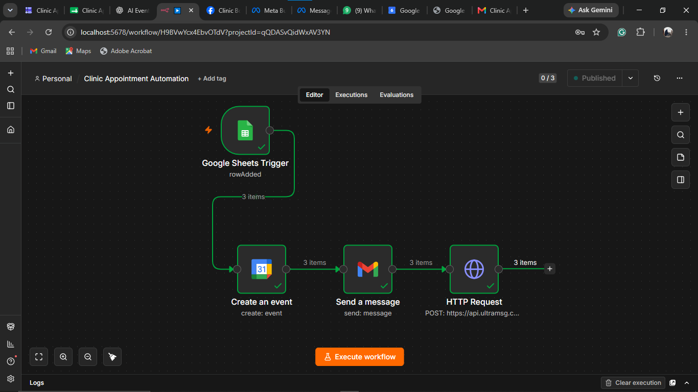
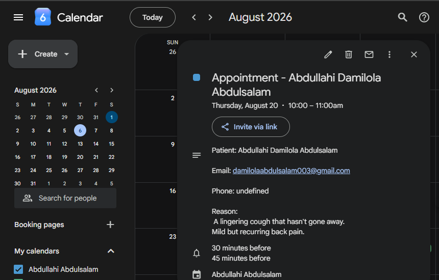
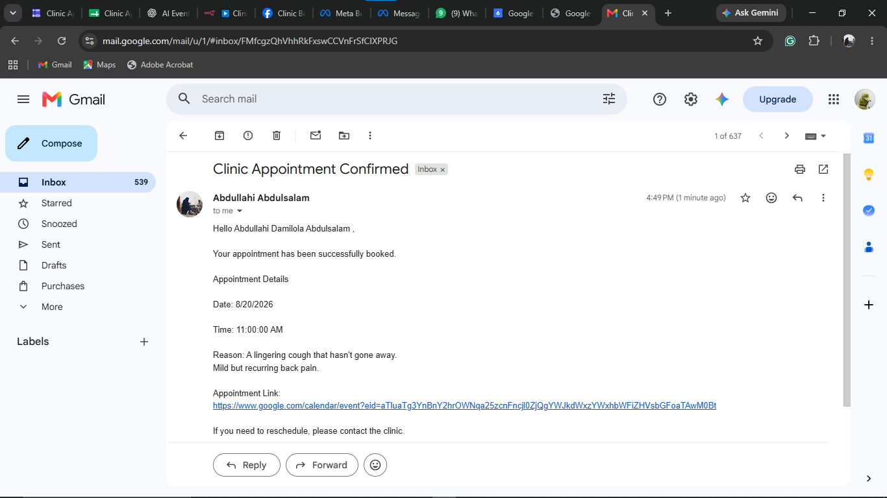
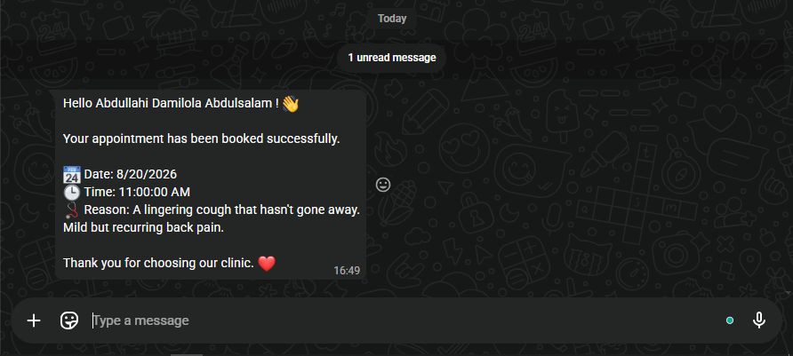

# 🏥 Clinic Appointment Automation

An end-to-end clinic appointment booking system built with **n8n** that automatically creates calendar events, sends email confirmations, and notifies patients on WhatsApp after they submit a Google Form.

This project demonstrates how low-code automation can eliminate repetitive administrative tasks in healthcare scheduling.

---

## 🚀 Features

- 📋 Accepts appointment requests through Google Forms
- 📊 Stores responses automatically in Google Sheets
- 📅 Creates Google Calendar events for each appointment
- 📧 Sends confirmation emails to patients
- 💬 Sends WhatsApp confirmation messages automatically
- ⚡ Fully automated workflow with no manual intervention

---

## 🛠️ Tech Stack

- n8n
- Google Forms
- Google Sheets
- Google Calendar API
- Gmail API
- UltraMsg WhatsApp API
- Docker

---

## 📌 Workflow

```text
Patient
   │
   ▼
Google Form
   │
   ▼
Google Sheets
   │
   ▼
n8n Automation
   ├────────► Google Calendar
   ├────────► Gmail
   └────────► WhatsApp
```

---

## 📷 Screenshots

### n8n Workflow



---

### Google Calendar Event



---

### Email Confirmation



---

### WhatsApp Confirmation



---

## 📂 Project Structure

```
clinic-booking-automation/
│
├── screenshots/
│   ├── calendar.png
│   ├── mail.png
│   ├── n8n DB.png
│   └── whatsapp.png
│
└── README.md
```

---

## 🔄 Automation Flow

1. Patient submits the appointment form.
2. Google Sheets stores the new response.
3. n8n detects the new row.
4. A Google Calendar event is created.
5. A confirmation email is sent.
6. A WhatsApp confirmation message is delivered automatically.

---

## 💡 Future Improvements

- Conflict detection for double bookings
- Automatic appointment rescheduling
- Official Meta WhatsApp Cloud API integration
- Admin dashboard
- SMS notifications
- Appointment reminders
- Cancellation and rescheduling workflow

---

## 🎯 Use Cases

- Medical clinics
- Dental clinics
- Hospitals
- Consultation booking
- Service appointment scheduling
- Small businesses requiring automated bookings

---

## 👨‍💻 Author

**Abdullahi Abdulsalam**

- LinkedIn: https://linkedin.com/in/abdullxxhi
- GitHub: https://github.com/abdullxxhi

---

⭐ If you found this project useful, consider giving it a star!
